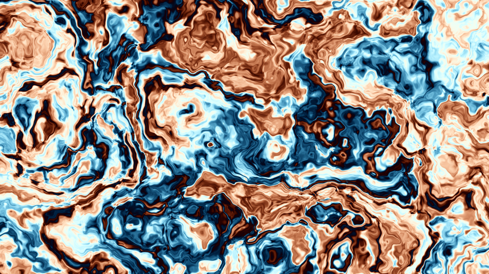

# Domain Warp

Real-time, animated domain-warped fractional-brownian perlin noise with C and
OpenGL.

Also compiled to WASM + WebGL for the web. Check out the
[live demo](https://ziap.github.io/domain-warp).

**Warning:** The code might not run well on your device, especially on mobile
so expect low FPS and choppy animation.



## How to use (this is also copy-pasted)

### Requirements

**Linux build**

- A C99 compiler
- GNU make
- GLFW
- GLEW

**WebAssembly build**

- Clang
- A web server (ex: `python -m http.server`)

**Windows build**

- `¯\_(ツ)_/¯`

### Building

Running this will compile both the Linux version and the web version

```
make
```

### Debugging

Compile with debug symbols then use gdb to debug

```
make debug

gdb ./debug/app
```

### Running

For the Linux version, the executable is located at `./build/app`

For the web version use a web server (See [above](#requirements)) to host the
website.

## License

This project is licensed under the [MIT License](LICENSE).
